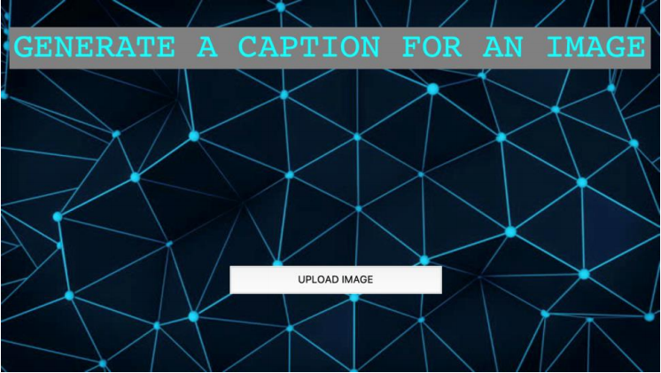
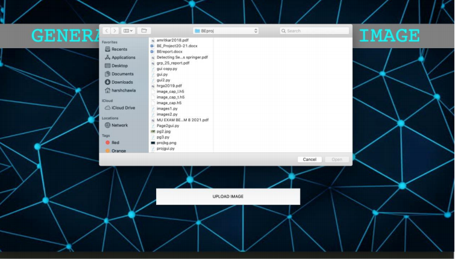
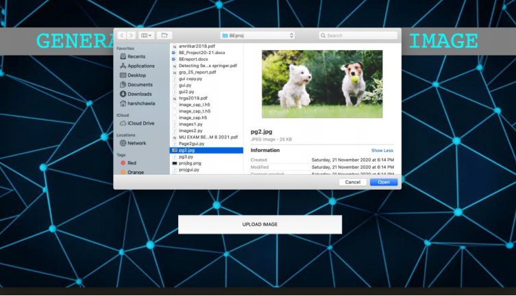
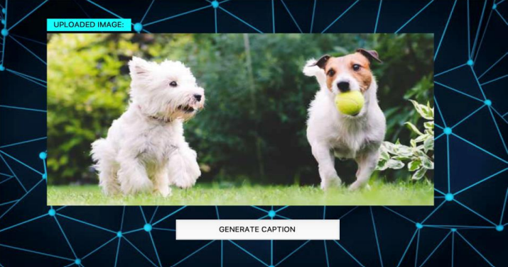
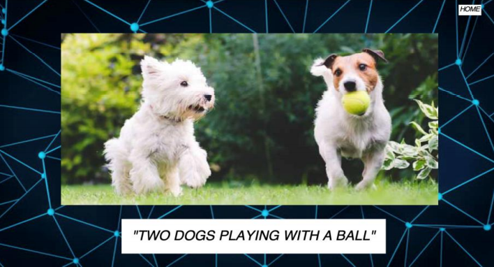

# Image-Caption-Generator
Implemented an encoder decoder architecture to generate captions for the images provided using computer vision and natural language processing. Applied Inception V3 model as the encoder to extract features from the image and a combination of transformer encoding and a bidirectional LSTM as the decoder for generating the words in the caption.

Link to the weight(h5) files: https://drive.google.com/drive/folders/1MtbGBxtx2us_cTqQ27-MowSQPTAJJn8Z?usp=sharing

**Output**

 
 
 
 

